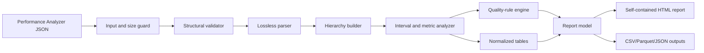

# Power BI Performance Analyzer JSON: File Format and Automated Reporting Solution Blueprint

**Prepared:** 2026-09-25  
**Purpose:** Technical specification and implementation blueprint for a solution that accepts a Power BI Performance Analyzer JSON export and produces an easy-to-consume report for report authors, model developers, and support teams.

> This document distinguishes **verified format facts** from **recommended solution design**. The format facts are based primarily on the Microsoft export-format document supplied with this request, the Microsoft JSON schema, and current Microsoft Learn guidance. Recommendations are implementation guidance derived from those facts.

---

## 1. Executive summary

Power BI Performance Analyzer records operations while a user interacts with a report and exports the underlying trace as JSON. The export is not a pre-aggregated report. It is a collection of timestamped events that form a **forest of parent/child trees**, linked by `id` and `parentId`.

A robust automated reporting solution should:

1. Validate the file envelope and required event fields.
2. Preserve every event and its free-form `metrics` property bag.
3. Reconstruct event hierarchy using `id` and `parentId`.
4. Compute wall-clock durations from `start` and `end`.
5. Attribute events to visual updates and, where possible, user actions.
6. Avoid double-counting overlapping parent and child intervals.
7. Detect cached executions, missing backend detail, abandoned visuals, query errors/cancellations, truncation, orphaned parents, and clock anomalies.
8. Produce both:
   - a self-contained human-readable report, preferably HTML; and
   - normalized machine-readable outputs for later comparison or ingestion.
9. Treat DAX and source-query text as potentially sensitive data.
10. Remain tolerant of unknown event names and metric properties so that newer Power BI releases do not break ingestion.

The recommended minimum output is a five-section report: **Run Summary, Visuals, Queries, Timeline, and Data Quality**.

---

## 2. Source hierarchy and scope

### 2.1 Primary source

- **Power BI Performance Analyzer Export File Format.pdf** — the document supplied in the request. It describes report execution concepts, the JSON envelope, event structure, parent/child correlation, event sequencing, optional metrics, event types, cardinality, truncation limits, cache behavior, and timestamp alignment caveats.

### 2.2 Public Microsoft sources

- [Use Performance Analyzer to examine report performance](https://learn.microsoft.com/en-us/power-bi/create-reports/performance-analyzer)
- [Microsoft Power BI Desktop samples: Performance Analyzer](https://github.com/microsoft/powerbi-desktop-samples/tree/main/Performance%20Analyzer)
- [Microsoft Power BI Report Performance Analyzer Export Schema](https://github.com/microsoft/powerbi-desktop-samples/blob/main/Performance%20Analyzer/performanceAnalyzerExport.schema.json)

### 2.3 Supporting implementation references

- [DAX Studio: Load Power BI Performance Data](https://daxstudio.org/docs/features/load-powerbi-perf-data/)
- [SQLBI: Importing Performance Analyzer data into DAX Studio](https://www.sqlbi.com/articles/importing-performance-analyzer-data-in-dax-studio/)
- [Microsoft Fabric Community: Loading Performance Analyzer JSON into Power BI](https://community.fabric.microsoft.com/t5/Desktop/load-performance-analyzer-data-json-into-power-bi/m-p/854791)

### 2.4 Source-age warning

The public schema and detailed export-format document were originally published with the early Performance Analyzer samples. Current Microsoft Learn guidance includes user-facing timing categories such as **Evaluated parameters**, which are not described in the older detailed event table. Therefore:

- validate known structural requirements;
- retain unknown event names and metric properties;
- warn rather than fail when a structurally valid file contains a new event type;
- version parser rules independently from the Power BI file's `version` value.

---

## 3. What Performance Analyzer measures

### 3.1 Major subsystems

The detailed Microsoft format document identifies these major execution areas:

| Subsystem | Component value | Role |
|---|---|---|
| Report Canvas | `Report Canvas` | Hosts visuals and filters, handles interactions, creates semantic queries, reads results, reshapes data, and renders visuals. |
| Data Shape Engine | `DSE` | Evaluates a semantic query by generating and running one or more DAX queries. |
| Data Model Engine / Analysis Services | `AS` | Evaluates DAX queries against the semantic model and, for DirectQuery/composite models, may issue source queries. |
| Change Detection | `Change Detection` | Evaluates the change-detection measure used by automatic page refresh. |

### 3.2 Logical execution chain

A useful conceptual chain is:

```text
User action
  -> updates one or more visuals
       -> each visual may run zero or one semantic query
            -> a semantic query may run one or more DAX queries
                 -> a DAX query may run zero or more DirectQuery source queries
       -> the visual transforms returned data and renders
```

Important qualifications:

- A visual can render without a query.
- A visual can use an in-memory cached semantic-query result; in that case, DSE and AS events may be absent.
- One semantic query can produce multiple DAX queries.
- One DAX query can produce multiple DirectQuery source queries.
- Front-end work is mostly serialized on a UI thread, while backend work can overlap.

### 3.3 Meaning of duration

For an event with both timestamps:

```text
duration_ms = end - start
```

This is **wall-clock elapsed time**, not CPU time. It can include queueing and waiting. Parent and child durations overlap, and sibling events can also overlap. Consequently:

> Never calculate a visual's total time by summing all descendant event durations.

Current Microsoft Learn guidance describes these user-facing categories:

- DAX query
- Direct query
- Visual display
- Other
- Evaluated parameters (preview at the time of the referenced Learn page)

The raw export contains lower-level events. A solution may map raw events into friendly categories, but it should label any reconstructed category as a derived value unless it is directly represented by one raw event.

---

## 4. JSON file contract

### 4.1 Root structure

The public schema is JSON Schema draft-06. The root object has two required properties:

| Property | Type | Required | Meaning |
|---|---|---:|---|
| `version` | string enum | Yes | Export format version. The published schema accepts `"1.0.0"`. |
| `events` | array | Yes | Events captured by Performance Analyzer. |

The published schema sets `additionalProperties: false` at the root and event levels.

### 4.2 Event structure

| Property | Type | Required | Meaning |
|---|---|---:|---|
| `id` | string | Yes | Unique identifier for the event. |
| `name` | string | Yes | Together with `component`, identifies the event kind. |
| `component` | string | Yes | Subsystem that performed the operation. |
| `start` | RFC 3339 date-time string | Yes | UTC start timestamp. |
| `parentId` | string | No | `id` of the parent event. Omitted for roots. |
| `end` | RFC 3339 date-time string | No | UTC end timestamp. Omitted for instantaneous events. |
| `metrics` | object | No | Optional, event-specific property bag. |

The published schema permits arbitrary properties inside `metrics` but not unknown properties directly on an event.

### 4.3 Minimal example

```json
{
  "version": "1.0.0",
  "events": [
    {
      "name": "User Action",
      "component": "Report Canvas",
      "start": "2019-04-26T19:42:01.991Z",
      "id": "ea168828b4c0175aa697",
      "metrics": {
        "sourceLabel": "UserAction_Refresh"
      }
    },
    {
      "name": "Visual Container Lifecycle",
      "component": "Report Canvas",
      "start": "2019-04-26T19:42:02.000Z",
      "end": "2019-04-26T19:42:02.343Z",
      "id": "c2d2e0b2cf6a46628b68",
      "metrics": {
        "status": "finished",
        "visualTitle": "Count of ProductKey by EnglishCountryRegionName"
      }
    },
    {
      "name": "Query",
      "component": "Report Canvas",
      "start": "2019-04-26T19:42:02.001Z",
      "end": "2019-04-26T19:42:02.325Z",
      "id": "a8d101ca1ff7de189598",
      "parentId": "c2d2e0b2cf6a46628b68"
    },
    {
      "name": "Render",
      "component": "Report Canvas",
      "start": "2019-04-26T19:42:02.325Z",
      "end": "2019-04-26T19:42:02.343Z",
      "id": "ccc0f88232a87649e78d",
      "parentId": "c2d2e0b2cf6a46628b68"
    }
  ]
}
```

### 4.4 Structural interpretation

The events form a **forest**, not necessarily one tree:

- root event: no `parentId`;
- child event: `parentId` resolves to another event's `id`;
- tree root: the highest reachable ancestor;
- visual ancestor: nearest ancestor whose key is `Report Canvas / Visual Container Lifecycle`;
- query ancestor: nearest ancestor whose key is `Report Canvas / Query` or `DSE / Execute Semantic Query`;
- orphan: `parentId` is present but does not resolve.

Use the pair `(component, name)` as the event-type key. `name` alone is not sufficient because `Metrics Truncated` can occur in more than one component.

---

## 5. Known event catalog

All documented metrics are optional. A missing metric must be represented as unknown/not supplied—not as false, zero, or an empty string.

| Component | Event name | Has `end` | Documented purpose | Documented metrics |
|---|---|---:|---|---|
| Report Canvas | `User Action` | No | Marks a point where the user interacted with the report. | `sourceLabel` (string) |
| Report Canvas | `Visual Container Lifecycle` | Yes | Tracks a visual update. | `status`: `started`, `finished`, or `abandoned`; `visualTitle`; `visualId`; `visualType` |
| Report Canvas | `Query` | Yes | Tracks generation and execution of the semantic query for a visual. | None documented |
| Report Canvas | `Query Generation` | Yes | Tracks generation of the semantic query. | None documented |
| Report Canvas | `Parse Query Result` | Yes | Parses semantic-query output into the canvas data-view structure. | None documented |
| Report Canvas | `Render` | Yes | Prepares data for the visual and updates the visual with query results. | None documented |
| Report Canvas | `Data View Transform` | Yes | Reshapes data and evaluates features such as forecasting and conditional formatting. | None documented |
| Report Canvas | `Geocoding` | Yes | Geocodes points for a map visual; present only when needed. | None documented |
| DSE | `Execute Semantic Query` | Yes | Evaluates one semantic query. | None documented |
| DSE | `Open Connection` | Yes | Opens a connection to the model; absent when an existing connection is reused. | None documented |
| DSE | `Execute DAX Query` | Yes | Runs one DAX query; ends when the first result row is received. | `QueryText`, `RowCount`, `Error`, `Canceled` |
| DSE | `Metrics Truncated` | No | Indicates omitted trace events. The detailed document states limits of 300 events per semantic-query execution and 200 events per DAX-query execution. | None documented in the table |
| AS | `Execute Query` | Yes | Evaluates one query in the data model. | None documented |
| AS | `Serialize Rowset` | Yes | Writes the query result. | None documented |
| AS | `Get Source Connection` | Yes | Acquires a DirectQuery source connection. | None documented |
| AS | `Execute Direct Query` | Yes | Executes a query against a DirectQuery source. | `QueryText`, `ActualQueryDuration`, `RowsRead`, `DataReadDuration`, `IsGetSourceCapabilitiesQuery` |
| AS | `Metrics Truncated` | No | Indicates omitted AS trace events; the detailed document states a 200-event limit per DAX-query execution. | `Count` |
| Change Detection | `Execute Change Detection` | Yes | Runs the automatic page refresh change-detection measure. | `changeDetectionMeasure` |

### 5.1 Metric semantics that matter to the report

- `DSE / Execute DAX Query / QueryText`: text of the DAX query.
- `DSE / Execute DAX Query / RowCount`: number of rows read from the DAX query.
- `DSE / Execute DAX Query / Error`: true when the DAX query failed.
- `DSE / Execute DAX Query / Canceled`: true when the DAX query was canceled.
- `AS / Execute Direct Query / QueryText`: source query text; documented as present only when the user owns the model and the source is SQL.
- `AS / Execute Direct Query / ActualQueryDuration`: milliseconds spent waiting for source execution.
- `AS / Execute Direct Query / DataReadDuration`: milliseconds spent reading the source result.
- `AS / Execute Direct Query / RowsRead`: rows read from the source query.
- `AS / Execute Direct Query / IsGetSourceCapabilitiesQuery`: identifies metadata/capability queries that should usually be separated from business-data queries.

---

## 6. Conditions that explain missing or misleading detail

The parser and report must explicitly account for these conditions.

### 6.1 Cache hits

If the Report Canvas uses its in-memory semantic-query result cache, DSE and AS events may be absent. This does not mean the backend took zero milliseconds; it means no backend query was executed for that visual update.

Recommended report label:

```text
Backend activity: Not observed (possible canvas cache hit or non-query visual)
```

Use “possible” unless the trace contains another direct indicator. A visual with no query at all can also lack backend events.

### 6.2 Remote model visibility

The detailed format document states that AS events do not appear for models hosted in SQL Server Analysis Services, Power BI, or Azure Analysis Services. Missing AS detail must therefore not be interpreted as proof that the model engine performed no work.

### 6.3 DirectQuery cardinality

`AS / Execute Direct Query` occurs only for DirectQuery or composite-model paths. Its absence in an import-model trace is expected.

### 6.4 Truncated traces

Any `Metrics Truncated` event means event-level detail is incomplete. The report should:

- display a prominent data-quality warning;
- retain the reported omitted count when available;
- avoid claiming that event counts or detailed duration decompositions are complete;
- still report top-level visual elapsed time if its lifecycle event is complete.

### 6.5 Timestamp alignment

Rendering can cross processes or machines whose clocks are not perfectly aligned. This can produce children slightly outside parent boundaries or apparently negative ordering across a process boundary.

Recommended handling:

- never modify raw timestamps;
- flag `end < start` as an error;
- flag child intervals outside parent intervals as warnings;
- use a configurable tolerance only for presentation/quality classification;
- do not silently “fix” timestamps.

### 6.6 Queueing and the `Other` category

Canvas operations are primarily serialized, while backend work may be parallel. Reported elapsed duration includes waiting. DAX Studio intentionally does not import Power BI's `Other` duration because it is largely queued/waiting time on the single-threaded rendering side. An automated report should retain `Other` when reconstructing a UI-oriented view, but should explain that it is not a clean measure of compute consumption.

---

## 7. Recommended solution architecture

This section is a design recommendation.



### 7.1 Components

1. **Input boundary**
   - Accept one `.json` file per analysis run.
   - Reject non-JSON content and enforce a configurable maximum size.
   - Compute SHA-256 for run identity and duplicate detection.
   - Optionally accept capture metadata: report name, page, scenario, storage mode, Power BI version, cache state, test machine, and analyst notes.

2. **Validator**
   - Strict mode: validate against Microsoft's published draft-06 schema.
   - Compatible mode: enforce required known properties and types but retain unknown event fields, event names, and metric keys.
   - Always run semantic checks that JSON Schema cannot fully express: duplicate IDs, broken parents, cycles, invalid status values, timestamp order, and parent/child interval anomalies.

3. **Lossless parser**
   - Preserve raw event JSON.
   - Parse known metric keys into typed columns.
   - Preserve the full `metrics` object as JSON.
   - Record all unknown keys for schema-drift reporting.

4. **Hierarchy builder**
   - Create an `id -> event` index.
   - Attach children to parents.
   - Detect cycles before recursive traversal.
   - Derive depth, root, ancestor IDs, and path.

5. **Interval analyzer**
   - Compute exact event elapsed duration when `end` is present.
   - Compute covered time using interval unions, not naïve sums.
   - Retain both raw elapsed and derived attribution values.

6. **Rule engine**
   - Generate transparent findings with evidence: affected event IDs, visual IDs/titles, durations, metric values, and rule IDs.
   - Keep thresholds in configuration, not hard-coded in parser logic.

7. **Renderer**
   - Generate self-contained HTML for end users.
   - Generate normalized CSV, JSON, or Parquet for automation and comparisons.
   - Optionally produce a Markdown summary, but use HTML for interactive filtering, expandable DAX, and a timeline.

### 7.2 Suggested implementation stack

A practical first implementation is:

- Python 3.12+
- `json` or `orjson` for loading
- `jsonschema` for strict validation
- `pydantic` models for tolerant typed parsing
- `pandas` or `polars` for normalized tables
- Plotly for timeline and distribution charts
- Jinja2 for a self-contained HTML report
- PyArrow for Parquet outputs
- `pytest` for fixtures and regression tests

A .NET implementation is equally viable. The data model and algorithms in this document are language-independent.

---

## 8. Recommended normalized data model

Do not flatten everything into one wide table and discard hierarchy. Use at least the following logical entities.

### 8.1 `runs`

| Column | Type | Notes |
|---|---|---|
| `run_id` | string | SHA-256 or generated ID |
| `source_file_name` | string | Original name |
| `source_sha256` | string | Reproducibility/deduplication |
| `export_version` | string | Root `version` |
| `event_count` | integer | Number of raw events |
| `min_start_utc` | datetime | Earliest event start |
| `max_end_utc` | datetime | Latest available end |
| `capture_elapsed_ms` | decimal | `max_end - min_start`, if possible |
| `strict_schema_valid` | boolean | Strict validation result |
| `quality_status` | string | Pass / Warning / Fail |
| `capture_metadata_json` | JSON | User-supplied context |

### 8.2 `events`

| Column | Type | Notes |
|---|---|---|
| `run_id` | string | Foreign key |
| `event_id` | string | Raw `id` |
| `parent_event_id` | string nullable | Raw `parentId` |
| `component` | string | Raw value |
| `event_name` | string | Raw `name` |
| `event_type_key` | string | `component + " / " + name` |
| `start_utc` | datetime | Parsed `start` |
| `end_utc` | datetime nullable | Parsed `end` |
| `duration_ms` | decimal nullable | Exact wall-clock elapsed time |
| `is_instantaneous` | boolean | `end` absent |
| `depth` | integer nullable | Derived from hierarchy |
| `root_event_id` | string nullable | Derived |
| `visual_event_id` | string nullable | Nearest visual-lifecycle ancestor |
| `semantic_query_event_id` | string nullable | Nearest semantic-query ancestor |
| `dax_query_event_id` | string nullable | Nearest DAX-query ancestor |
| `metrics_json` | JSON nullable | Lossless property bag |
| `raw_event_json` | JSON | Lossless event |

### 8.3 `visual_updates`

One row per `Report Canvas / Visual Container Lifecycle` event.

| Column | Type | Notes |
|---|---|---|
| `visual_event_id` | string | Event ID |
| `visual_id` | string nullable | Stable only within the report definition; do not assume global uniqueness |
| `visual_title` | string nullable | Fall back to visual type only for display if title is absent |
| `visual_type` | string nullable | Raw metric |
| `status` | string nullable | `started`, `finished`, `abandoned`, or unknown |
| `start_utc` / `end_utc` | datetime | Raw times |
| `total_elapsed_ms` | decimal nullable | Lifecycle duration |
| `has_canvas_query` | boolean | Descendant `Report Canvas / Query` exists |
| `has_dax_query` | boolean | Descendant `DSE / Execute DAX Query` exists |
| `has_direct_query` | boolean | Descendant `AS / Execute Direct Query` exists |
| `possible_canvas_cache_hit` | boolean | Derived, qualified indicator |
| `query_count` | integer | Descendant DAX-query count |
| `direct_query_count` | integer | Descendant source-query count |
| `data_quality_status` | string | Good / Warning / Incomplete |

### 8.4 `queries`

One row per `DSE / Execute DAX Query` event.

Recommended fields: event/visual IDs, elapsed duration, `QueryText`, `RowCount`, `Error`, `Canceled`, DAX fingerprint, query-text availability, descendant AS event counts, and truncation flags.

### 8.5 `direct_queries`

One row per `AS / Execute Direct Query` event.

Recommended fields: event/DAX/visual IDs, elapsed duration, `ActualQueryDuration`, `DataReadDuration`, `RowsRead`, capabilities-query flag, query text, and query fingerprint.

### 8.6 `quality_issues`

| Column | Purpose |
|---|---|
| `rule_id` | Stable machine-readable rule |
| `severity` | Info / Warning / Error |
| `scope_type` | Run / Event / Visual / Query |
| `scope_id` | Related ID |
| `message` | Human-readable explanation |
| `evidence_json` | Values that triggered the rule |

### 8.7 `findings`

Keep performance recommendations separate from data-quality issues. A finding should include:

- rule ID and version;
- severity/priority;
- visual and query references;
- observed evidence;
- plain-language impact;
- recommended next diagnostic step;
- whether the finding is exact or heuristic.

---

## 9. Parsing and hierarchy algorithm

### 9.1 Required processing order

1. Parse JSON.
2. Validate root envelope.
3. Validate each event's required fields.
4. Parse timestamps without changing them.
5. Index all events by `id`.
6. Detect duplicate IDs.
7. Resolve `parentId` references.
8. Detect cycles.
9. Derive ancestors and depth.
10. Compute event durations.
11. Extract known metrics while retaining raw metrics.
12. Attribute events to visual updates.
13. Attribute root visual updates to user actions only as a separate, clearly labeled temporal inference.
14. Calculate interval-safe summaries.
15. Run quality and performance rules.
16. Render outputs.

### 9.2 Reference Python parser skeleton

```python
from __future__ import annotations

import hashlib
import json
from dataclasses import dataclass, field
from datetime import datetime
from pathlib import Path
from typing import Any


def parse_utc(value: str) -> datetime:
    # Python accepts +00:00; normalize the RFC 3339 Z suffix.
    return datetime.fromisoformat(value.replace("Z", "+00:00"))


@dataclass
class Event:
    id: str
    name: str
    component: str
    start: datetime
    parent_id: str | None = None
    end: datetime | None = None
    metrics: dict[str, Any] = field(default_factory=dict)
    raw: dict[str, Any] = field(default_factory=dict)

    @property
    def type_key(self) -> str:
        return f"{self.component} / {self.name}"

    @property
    def duration_ms(self) -> float | None:
        if self.end is None:
            return None
        return (self.end - self.start).total_seconds() * 1000.0


def load_trace(path: Path) -> tuple[dict[str, Any], list[Event]]:
    raw_bytes = path.read_bytes()
    doc = json.loads(raw_bytes)

    if not isinstance(doc, dict):
        raise ValueError("Root must be an object")
    if "version" not in doc or "events" not in doc:
        raise ValueError("Root must contain version and events")
    if not isinstance(doc["events"], list):
        raise ValueError("events must be an array")

    events: list[Event] = []
    seen: set[str] = set()

    for i, raw in enumerate(doc["events"]):
        if not isinstance(raw, dict):
            raise ValueError(f"events[{i}] must be an object")

        missing = {"id", "name", "component", "start"} - raw.keys()
        if missing:
            raise ValueError(f"events[{i}] missing: {sorted(missing)}")

        event_id = raw["id"]
        if event_id in seen:
            raise ValueError(f"Duplicate event id: {event_id}")
        seen.add(event_id)

        metrics = raw.get("metrics") or {}
        if not isinstance(metrics, dict):
            raise ValueError(f"events[{i}].metrics must be an object")

        events.append(
            Event(
                id=event_id,
                parent_id=raw.get("parentId"),
                name=raw["name"],
                component=raw["component"],
                start=parse_utc(raw["start"]),
                end=parse_utc(raw["end"]) if raw.get("end") else None,
                metrics=metrics,
                raw=raw,
            )
        )

    run = {
        "source_file_name": path.name,
        "source_sha256": hashlib.sha256(raw_bytes).hexdigest(),
        "export_version": doc["version"],
        "event_count": len(events),
    }
    return run, events


def build_indexes(events: list[Event]):
    by_id = {event.id: event for event in events}
    children: dict[str, list[Event]] = {event.id: [] for event in events}
    orphans: list[Event] = []

    for event in events:
        if event.parent_id is None:
            continue
        parent = by_id.get(event.parent_id)
        if parent is None:
            orphans.append(event)
        else:
            children[parent.id].append(event)

    return by_id, children, orphans


def ancestor_of_type(event: Event, by_id: dict[str, Event], type_key: str) -> Event | None:
    current = event
    visited: set[str] = set()
    while current.parent_id:
        if current.id in visited:
            raise ValueError(f"Cycle detected at event {current.id}")
        visited.add(current.id)
        current = by_id.get(current.parent_id)
        if current is None:
            return None
        if current.type_key == type_key:
            return current
    return None
```

Production code should collect validation errors rather than stopping on the first issue, subject to a maximum issue count.

### 9.3 Temporal user-action attribution

The detailed format describes user actions and visual updates, but root-level event examples do not guarantee a direct `parentId` link from every visual lifecycle to a user action. If end-user reporting needs an “interaction” grouping, implement it as a separate derived layer:

1. Sort `User Action` events by `start`.
2. Sort root visual-lifecycle events by `start`.
3. Assign a root visual update to the nearest preceding user action until the next user action boundary.
4. Do not assign when ordering is ambiguous or outside a configured capture window.
5. Label the result `derived_interaction_id`, not `parent_event_id`.

This attribution is a reporting heuristic, not a replacement for the raw hierarchy.

---

## 10. Correct interval calculations

### 10.1 Do not sum overlapping intervals

Suppose a visual lasts 1,000 ms and contains two backend queries that each last 700 ms and overlap for 500 ms. Their naïve sum is 1,400 ms, which exceeds the visual's elapsed time. That is expected in parallel execution.

Keep these measures separate:

| Measure | Formula | Use |
|---|---|---|
| Event elapsed | `end - start` | Exact wall-clock duration for one event |
| Descendant duration sum | Sum of selected descendants | Work-volume indicator only; may exceed parent elapsed time |
| Covered duration | Union of selected descendant intervals | Time during which at least one selected operation was active |
| Approximate exclusive duration | Parent elapsed minus union of direct-child intervals, clamped | Diagnostic estimate; sensitive to clock alignment and incomplete traces |
| Critical-path duration | Longest dependency/interval path under defined rules | Advanced diagnostic; rules must be documented |

### 10.2 Interval-union function

```python
from datetime import datetime


def covered_ms(intervals: list[tuple[datetime, datetime]]) -> float:
    valid = sorted((s, e) for s, e in intervals if e >= s)
    if not valid:
        return 0.0

    merged: list[list[datetime]] = [[valid[0][0], valid[0][1]]]
    for start, end in valid[1:]:
        last = merged[-1]
        if start <= last[1]:
            if end > last[1]:
                last[1] = end
        else:
            merged.append([start, end])

    return sum((end - start).total_seconds() * 1000 for start, end in merged)
```

When calculating coverage inside a parent, first intersect every child interval with the parent interval. Keep a quality flag when a child needed clipping.

---

## 11. Friendly performance categories

Use two views rather than forcing all raw events into one set of UI buckets.

### 11.1 Exact event view

Show raw `(component, name)` events and exact elapsed durations. This is the audit view and should always be available.

### 11.2 Derived end-user view

Recommended mapping:

| Friendly category | Primary raw evidence | Notes |
|---|---|---|
| Visual total | `Report Canvas / Visual Container Lifecycle` | Exact lifecycle elapsed time when `end` exists |
| Canvas query | `Report Canvas / Query` | Includes semantic-query orchestration; do not add descendant durations to it |
| Query generation | `Report Canvas / Query Generation` | Exact event elapsed |
| DAX query | `DSE / Execute DAX Query` | One semantic query may contain multiple DAX queries |
| Direct source query | `AS / Execute Direct Query` | Use event elapsed plus the source metrics as separate measures |
| Result parsing | `Report Canvas / Parse Query Result` | Exact event elapsed |
| Data transform | `Report Canvas / Data View Transform` | Exact event elapsed |
| Visual display | `Report Canvas / Render` | Closest documented raw event to the UI's visual-display concept |
| Geocoding | `Report Canvas / Geocoding` | Only when present |
| Other / waiting | Visual elapsed minus union of selected explained canvas intervals | Derived approximation; label clearly |
| Evaluated parameters | Preserve a matching new event/metric if observed | Do not invent mapping without an observed raw representation |

Do not claim that the derived categories exactly reproduce the Performance Analyzer pane unless regression tests against real exports demonstrate that for the target Power BI versions.

---

## 12. Data-quality rules

Recommended baseline rules:

| Rule ID | Severity | Condition |
|---|---|---|
| `ROOT_NOT_OBJECT` | Error | Root JSON value is not an object |
| `ROOT_REQUIRED_FIELD_MISSING` | Error | `version` or `events` missing |
| `EVENT_REQUIRED_FIELD_MISSING` | Error | `id`, `name`, `component`, or `start` missing |
| `EVENT_ID_DUPLICATE` | Error | Duplicate event ID |
| `PARENT_NOT_FOUND` | Warning | `parentId` does not resolve |
| `PARENT_CYCLE` | Error | Cycle detected in parent graph |
| `TIMESTAMP_INVALID` | Error | Timestamp cannot be parsed as RFC 3339 date-time |
| `NEGATIVE_DURATION` | Error | `end < start` |
| `CHILD_OUTSIDE_PARENT` | Warning | Child interval falls outside parent interval |
| `TRACE_TRUNCATED` | Warning | Any `Metrics Truncated` event observed |
| `VISUAL_ABANDONED` | Warning | Visual lifecycle status is `abandoned` |
| `DAX_ERROR` | Error | DAX metric `Error` is true |
| `DAX_CANCELED` | Warning | DAX metric `Canceled` is true |
| `UNKNOWN_EVENT_TYPE` | Info | New `(component, name)` pair observed |
| `UNKNOWN_METRIC` | Info | New metric key observed |
| `STRICT_SCHEMA_MISMATCH` | Warning/Error | Configurable; compatible parser may still continue |
| `QUERY_TEXT_UNAVAILABLE` | Info | Query event exists but text is absent |

The report should distinguish **invalid input**, **incomplete trace**, and **valid but unfamiliar schema drift**.

---

## 13. Performance findings and heuristics

Thresholds should be configurable per organization and scenario. Do not embed universal red/amber millisecond cutoffs.

Recommended rule families:

1. **Slow visual relative to the run**
   - Rank completed visual lifecycle durations.
   - Flag configured top-N or percentile.
   - Also show the absolute elapsed duration.

2. **Slow DAX query**
   - Rank `DSE / Execute DAX Query` durations.
   - Include visual title/type, row count, error/cancel state, query fingerprint, and expandable query text.

3. **Slow source query**
   - Rank `AS / Execute Direct Query` by event elapsed and `ActualQueryDuration` separately.
   - Show `DataReadDuration`, rows read, and capabilities-query flag.

4. **High result volume**
   - Rank DAX `RowCount` and DirectQuery `RowsRead`.
   - Avoid claiming causality; present as a diagnostic lead.

5. **Rendering/data-transform dominant**
   - Compare covered `Render`, `Data View Transform`, and `Geocoding` time with visual elapsed time.

6. **Waiting/other dominant**
   - Use derived unexplained elapsed time.
   - Explain that UI-thread queueing can contribute.

7. **Repeated query fingerprint**
   - Normalize query text for comparison without changing the retained raw query.
   - Count repeated fingerprints across visuals and interactions.
   - Treat as an investigation lead, not proof of a defect.

8. **Cache comparison**
   - Compare multiple intentionally labeled runs: cold, warm, visual refresh, or page refresh.
   - Do not infer cache state from file names alone.

9. **Abandoned update**
   - Highlight visual lifecycle events with `status = abandoned` and correlate with subsequent updates.

10. **Trace incompleteness**
    - Suppress or qualify detailed bottleneck conclusions when truncation is present.

Every finding must show the evidence and recommended next step. Example:

```text
Observation: Visual “Sales by Region” is the slowest completed visual in this run at 2,840 ms.
Evidence: Visual lifecycle event <id>; DAX query 1,930 ms; render 210 ms.
Next step: Open the captured DAX query in DAX Studio and collect Server Timings and Query Plan.
Classification: Relative-to-run heuristic; thresholds configured by the solution owner.
```

---

## 14. End-user report specification

### 14.1 Page 1 — Run Summary

Show:

- source filename and SHA-256;
- export version;
- capture start/end and elapsed span;
- event count;
- visual update count;
- completed/abandoned status counts;
- DAX and DirectQuery counts;
- error, cancellation, orphan, and truncation counts;
- top five visuals by elapsed time;
- top five DAX queries by elapsed time;
- a clear quality banner: Pass, Warning, or Fail.

### 14.2 Page 2 — Visuals

Sortable table:

| Visual | Type | Status | Total ms | Canvas query ms | DAX covered ms | DirectQuery covered ms | Render ms | Transform ms | Derived other ms | Flags |
|---|---|---|---:|---:|---:|---:|---:|---:|---:|---|

Features:

- search by title/type;
- filter by status and flags;
- expand a visual to show its event tree;
- distinguish missing data from zero;
- show a small timeline for selected visual.

### 14.3 Page 3 — Queries

For DAX:

- duration;
- row count;
- error/canceled state;
- visual context;
- query fingerprint;
- expandable/copyable query text;
- child AS/DirectQuery summary.

For DirectQuery:

- event elapsed;
- `ActualQueryDuration`;
- `DataReadDuration`;
- rows read;
- metadata/capabilities-query indicator;
- expandable query text when present.

### 14.4 Page 4 — Timeline

Use a Gantt/flame-chart style visualization:

- horizontal axis: UTC time or milliseconds from capture start;
- row grouping: visual, component, or event path;
- color: component or friendly category;
- hover: event ID, parent ID, start, end, duration, and metrics;
- indicators for instantaneous events;
- warning markers for truncated traces and clock anomalies.

### 14.5 Page 5 — Data Quality and Methodology

Show:

- schema mode and validation results;
- unknown event types/metrics;
- orphaned parents and cycles;
- timestamp anomalies;
- truncation details;
- missing query text explanations;
- formulas and mapping rules used by this report;
- parser/rule-set version.

This page is essential because the trace can be incomplete or cross process/machine boundaries.

---

## 15. Query-text handling and privacy

DAX and source SQL can expose:

- table, column, measure, and model names;
- tenant or customer identifiers;
- filter literals and selected values;
- server/database/source information;
- business logic.

Recommended controls:

1. Process files locally or within the approved tenant boundary.
2. Do not send query text to external telemetry or AI services by default.
3. Make raw query display permission-controlled.
4. Provide `--redact-query-text` and `--omit-query-text` modes.
5. Hash normalized query text for grouping when raw text is hidden.
6. Escape query text before inserting it into HTML.
7. Use a restrictive Content Security Policy for generated HTML.
8. Never execute query text during report generation.
9. Retain the original file separately from derived outputs, subject to retention policy.

---

## 16. Compatibility strategy

Use three layers:

### 16.1 Layer A — raw preservation

Store the exact root JSON and exact event/metrics objects or retain the source file by immutable hash.

### 16.2 Layer B — stable canonical columns

Populate known fields and typed metrics. Unknown fields remain available in raw JSON.

### 16.3 Layer C — versioned interpretation rules

Maintain a parser/rule-set version such as:

```text
parser_version: 1.0.0
mapping_version: 1.0.0
finding_rules_version: 1.0.0
```

Record these versions in every output so that two reports can be reproduced and compared.

### 16.4 Strict versus compatible validation

- **Strict:** useful for tests and conformance checks against the published schema.
- **Compatible:** recommended for end-user ingestion; continue on unknown non-destructive additions while emitting schema-drift warnings.

Unsupported root shapes, missing required event identifiers, cycles, or invalid timestamps should still fail or quarantine the affected records.

---

## 17. Testing strategy

### 17.1 Unit fixtures

Include at least:

1. Valid minimal `1.0.0` file.
2. Empty `events` array.
3. Instantaneous `User Action` event.
4. Completed visual with Query and Render children.
5. Visual with no query.
6. Possible cache-hit visual.
7. One semantic query with multiple DAX queries.
8. DAX query with multiple overlapping DirectQuery events.
9. Abandoned visual lifecycle.
10. DAX error and cancellation.
11. DSE and AS truncation events.
12. Duplicate ID.
13. Missing parent.
14. Parent cycle.
15. Child outside parent interval.
16. Negative duration.
17. Unknown event type and metric.
18. Missing query text.
19. Cross-run repeated query fingerprint.
20. Malicious strings for HTML-escaping tests.

### 17.2 Golden report tests

For fixed fixture inputs, store expected:

- normalized event rows;
- derived hierarchy fields;
- interval-union results;
- quality issues;
- finding IDs;
- rendered report snapshots or deterministic HTML fragments.

### 17.3 Real-version regression matrix

Capture controlled traces from the supported Power BI Desktop/service versions and scenarios:

- import model;
- DirectQuery model;
- composite model;
- local model versus remote semantic model;
- first load versus repeat interaction;
- page refresh versus single-visual refresh;
- automatic page refresh/change detection;
- map/geocoding visual;
- field parameters/evaluated parameters;
- intentionally slow DAX and slow source query.

Do not claim UI parity until automated comparisons confirm the mapping for each supported version.

---

## 18. Command-line and API contract

### 18.1 Suggested CLI

```bash
pbi-pa-report analyze PowerBIPerformanceData.json \
  --out ./report-output \
  --format html,json,csv \
  --validation compatible \
  --metadata capture-context.json \
  --redact-query-text
```

Suggested output:

```text
report-output/
  index.html
  run-summary.json
  events.parquet
  visual-updates.csv
  dax-queries.csv
  direct-queries.csv
  findings.json
  quality-issues.json
  manifest.json
```

### 18.2 Suggested REST API

```http
POST /api/v1/performance-analyzer/reports
Content-Type: multipart/form-data

file=<json>
metadata=<json>
options=<json>
```

Response:

```json
{
  "reportId": "...",
  "status": "completed",
  "qualityStatus": "warning",
  "artifacts": [
    {"type": "html", "name": "index.html"},
    {"type": "json", "name": "run-summary.json"}
  ]
}
```

For sensitive environments, prefer synchronous local generation or an approved tenant-hosted service with short-lived storage.

---

## 19. Minimum viable product

### Phase 1 — trustworthy parser and static report

Deliver:

- JSON loading and compatible validation;
- complete raw-event table;
- hierarchy reconstruction;
- durations and visual attribution;
- known metric extraction;
- quality warnings;
- sortable self-contained HTML report;
- CSV/JSON outputs;
- unit fixtures and golden tests.

### Phase 2 — richer diagnostics

Add:

- interactive timeline;
- configurable finding rules;
- query fingerprinting and repeated-query analysis;
- DAX Studio handoff;
- multi-run comparison;
- cold/warm capture metadata;
- query-text redaction policies.

### Phase 3 — operationalization

Add:

- web/API front end;
- tenant identity and authorization;
- retention controls;
- central history and trend analysis;
- CI/CD capture ingestion;
- Power BI or Fabric-hosted analytical model over normalized outputs.

---

## 20. Acceptance criteria

The solution is ready for initial use when all of the following are true:

- A valid export produces a report without losing any event or metric.
- Duplicate IDs, broken parents, cycles, invalid timestamps, truncation, errors, cancellations, and abandoned visuals are visible.
- The event tree can be inspected from visual to DAX and DirectQuery detail.
- Parent/child overlaps are not double-counted in elapsed-time summaries.
- Unknown event names or metric keys are retained and reported.
- Missing events are shown as unknown/not observed, not zero.
- Every displayed derived metric has an accessible formula or methodology note.
- Query text is escaped, never executed, and can be omitted/redacted.
- Reports include source hash plus parser, mapping, and rules versions.
- Automated tests cover the fixture matrix in Section 17.
- Real captures from each supported Power BI version pass regression tests.

---

## 21. Recommended next implementation step

Build the parser as a small, independently tested library before building the visual report. The first milestone should accept one export and produce:

1. `events.parquet` or `events.csv` with lossless event fields;
2. `visual-updates.csv`;
3. `dax-queries.csv`;
4. `direct-queries.csv`;
5. `quality-issues.json`; and
6. one self-contained `index.html` report.

This sequence establishes correctness and reproducibility before adding heuristic recommendations or multi-run comparisons.

---

## 22. Reference checklist for implementers

- [ ] Use `(component, name)` as event type.
- [ ] Preserve raw JSON and the complete `metrics` property bag.
- [ ] Validate required root and event properties.
- [ ] Detect duplicate IDs, missing parents, and cycles.
- [ ] Parse timestamps as UTC RFC 3339.
- [ ] Calculate duration only when `end` exists.
- [ ] Never treat missing duration or metrics as zero.
- [ ] Never sum parent and descendant elapsed durations as a total.
- [ ] Use interval union for covered time.
- [ ] Keep user-action temporal attribution separate from `parentId` hierarchy.
- [ ] Flag truncation and qualify detailed conclusions.
- [ ] Explain cache and remote-model visibility.
- [ ] Retain unknown events/metrics.
- [ ] Secure and optionally redact query text.
- [ ] Version mappings and rule sets.
- [ ] Include methodology and quality pages in the report.

---

## Appendix A — Published schema, formatted

The following is a formatted representation of the public Microsoft schema's structural contract:

```json
{
  "$schema": "http://json-schema.org/draft-06/schema",
  "id": "http://schemas.microsoft.com/powerbi/performanceanalyzerexport.json",
  "title": "Microsoft Power BI Report Performance Analyzer Export Schema",
  "type": "object",
  "properties": {
    "version": {
      "description": "Version of the export file",
      "enum": ["1.0.0"]
    },
    "events": {
      "description": "Events captured by the performance analyzer.",
      "type": "array",
      "items": {
        "description": "Represents an operation that occurred while updating a visual.",
        "type": "object",
        "properties": {
          "id": {"type": "string"},
          "parentId": {"type": "string"},
          "name": {"type": "string"},
          "component": {"type": "string"},
          "start": {"type": "string", "format": "date-time"},
          "end": {"type": "string", "format": "date-time"},
          "metrics": {"type": "object"}
        },
        "required": ["id", "name", "component", "start"],
        "additionalProperties": false
      }
    }
  },
  "required": ["version", "events"],
  "additionalProperties": false
}
```

For exact validation, obtain the current schema directly from Microsoft's repository rather than copying this formatted excerpt into production.

## Appendix B — Glossary

| Term | Meaning |
|---|---|
| AS | Analysis Services / data model engine component shown in the trace |
| DAX | Data Analysis Expressions; query language used against the semantic model |
| DSE | Data Shape Engine, which evaluates semantic queries and generates DAX |
| DirectQuery | Storage mode/path where model queries can trigger source-system queries |
| Event forest | Multiple parent/child trees in one export |
| Event type key | Combined `component / name` identifier |
| Wall-clock duration | Difference between end and start timestamps, including waiting |
| Covered time | Union of overlapping intervals |
| Query fingerprint | Stable hash of normalized query text used for grouping |
| Strict validation | Conformance against the published JSON schema |
| Compatible validation | Tolerant parsing that preserves new fields/types while enforcing core safety constraints |
