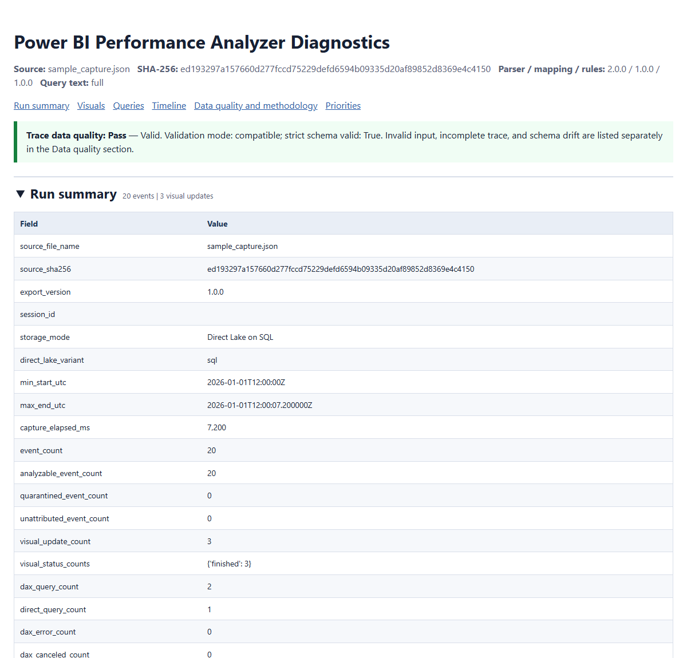
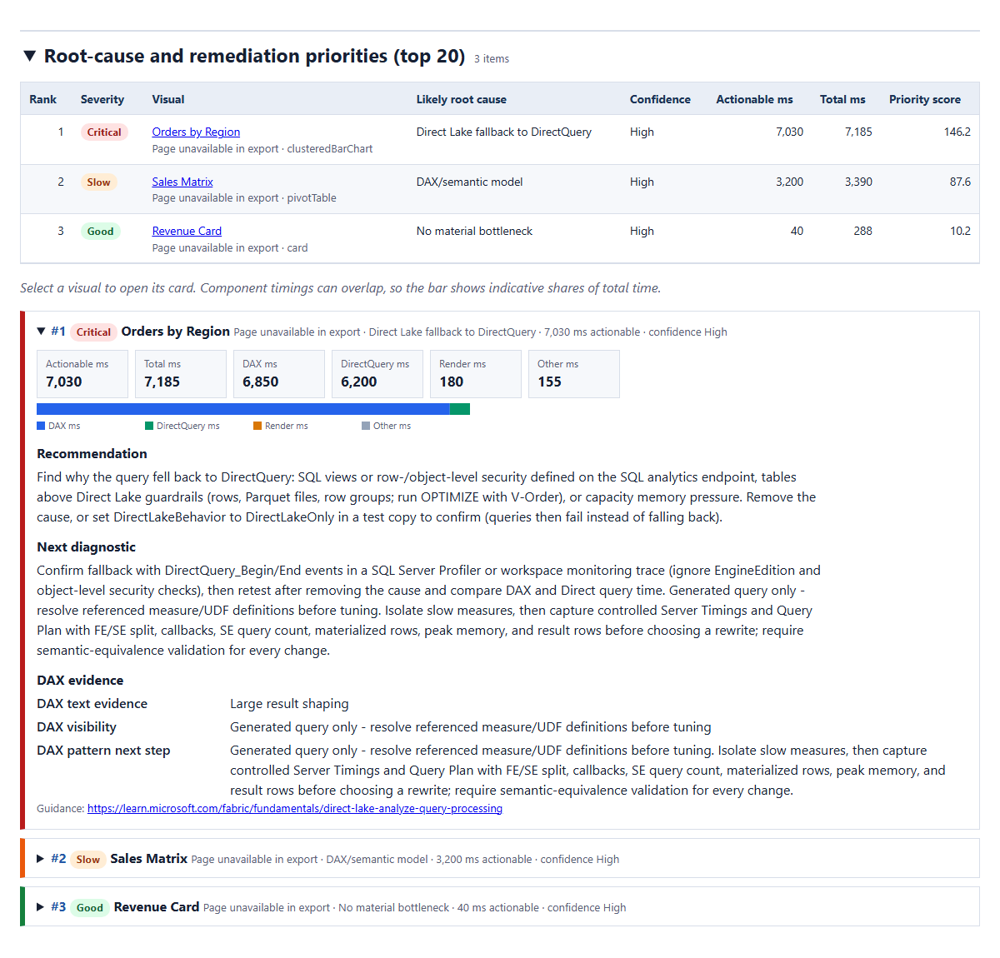
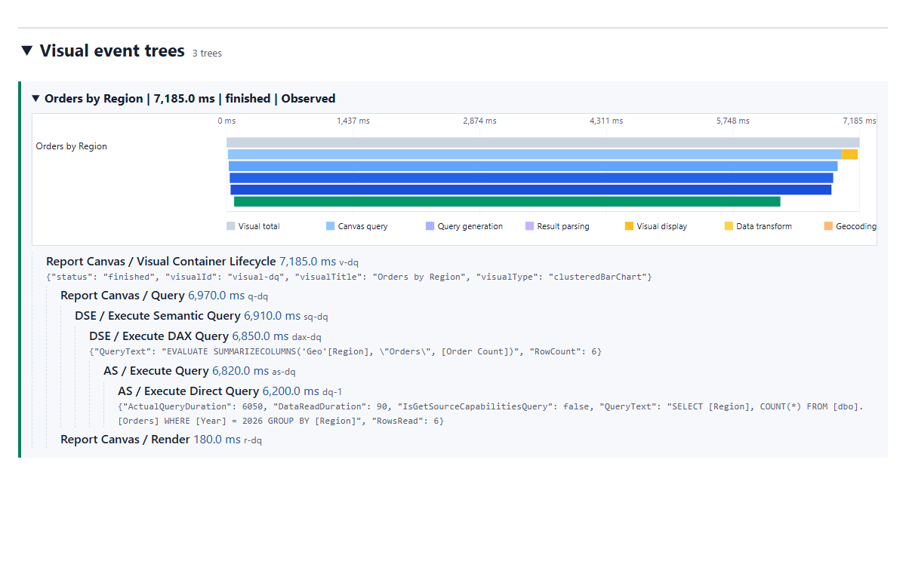

# Power BI Performance Analyzer Diagnostics

Turn a Power BI **Performance Analyzer JSON export** into a prioritized, evidence-backed root-cause report: which visuals are slow, *why* they are likely slow (DAX, DirectQuery / Direct Lake fallback, rendering, parameters, or UI-thread waiting), what to investigate next, and how much you can trust the trace.

One notebook. One JSON file in. A self-contained HTML report, a Markdown report, and machine-readable CSV/JSON out.



## Why this is useful

Performance Analyzer shows timings in the pane, but its export is a raw forest of thousands of parent/child events. Reading it by hand is slow and easy to get wrong:

- **Durations overlap.** A visual's DAX queries can run in parallel, so summing them overstates the time. This notebook uses **interval unions** (covered time) and never adds overlapping events.
- **Missing is not zero.** A cached visual has no DAX events; a remote model has no Analysis Services events; a truncated trace hides detail. The report says *not observed* or *unknown* instead of silently showing `0`.
- **Exports drift.** Power BI 1.1.0 exports omit `component` on most canvas events, add `sessionId`, and use numeric visual status codes. The parser infers what it safely can and reports the rest as schema drift instead of failing or guessing.
- **Recommendations depend on storage mode.** DirectQuery time on an Import/DirectQuery model means source tuning; on a **Direct Lake** model it means *fallback*, which has completely different fixes. The notebook switches guidance when you tell it the storage mode.
- **Query text is sensitive.** DAX and SQL expose model names and filter values. Outputs can be produced with query literals **redacted** or query text **omitted** entirely.

Typical uses: triaging a slow report page, preparing a DAX-optimization handoff, explaining Direct Lake fallback to a customer, comparing a change before/after, or attaching a reproducible, hashed diagnostic package to a support case.

## What you get

| Report section | What it answers |
| --- | --- |
| **Trace data quality banner** | Can I trust this capture? Pass / Warning / Fail, separating invalid input, incomplete trace, and schema drift. |
| **Run summary** | Source file + SHA-256, export version, storage mode, capture span, event / visual / DAX / DirectQuery counts, errors, orphans, truncation, top 5 visuals and top 5 DAX queries. |
| **Root-cause and remediation priorities** | A ranked, sortable summary plus one expandable card per visual with timing tiles, a timing bar, the recommendation, the next diagnostic step, DAX evidence, and a Microsoft guidance link. |
| **Visuals** | Every visual update with total, canvas-query, DAX, DirectQuery, render, transform, and derived-other time; search, status/flag filters, and sorting. |
| **Visual event trees** | The full Visual -> Query -> DSE -> DAX -> AS -> DirectQuery tree per visual, with a zoomed per-visual timeline. |
| **Queries** | Every DAX and DirectQuery event with duration, row counts, error/cancel state, fingerprint, and expandable, copyable query text. |
| **Timeline** | Gantt-style view of all events (hover for event details; markers for truncation and clock anomalies). |
| **Data quality and methodology** | Every rule that fired, unknown event types/metrics, formulas used, the event mapping, and parser / mapping / rule versions. |





## Quick start

### 1. Capture a Performance Analyzer export

1. Open the report in Power BI Desktop, then **View > Performance analyzer > Start recording**.
2. Reproduce the slow interaction. For fair comparisons, use **Refresh visuals** a second time after the report is warm.
3. **Stop**, then **Export** the JSON file.

### 2. Run the notebook

Requirements: Python 3.11+ with `pandas` and `numpy` (tested with Python 3.13 and pandas 3.0). Optional: `plotly` for interactive notebook charts, `pyarrow` for `events.parquet`, `jinja2` for styled notebook tables.

```powershell
pip install pandas numpy        # optional: plotly pyarrow jinja2
```

Open `Power BI Performance Analyzer Diagnostics.ipynb` in VS Code or Jupyter, set these values in the first code cell, and choose **Run All**:

```python
INPUT_PATH = r"C:\captures\PowerBIPerformanceData.json"   # a file, or a folder (newest JSON is used)
CAPTURE_METADATA["storage_mode"] = "Direct Lake on SQL"    # or "Import", "DirectQuery", "Composite", "Direct Lake on OneLake"
CAPTURE_METADATA["cache_state"] = "warm"                   # "cold" or "warm", if known
QUERY_TEXT_MODE = "full"                                   # "redact" or "omit" before sharing outputs
```

No capture yet? Set `USE_SAMPLE_IF_NO_FILE = True` to run on a built-in synthetic sample (clearly marked as demo data).

### 3. Or run it from the command line

The first cell is tagged `parameters` (papermill-compatible) and reads environment overrides:

```powershell
$env:PBI_PA_INPUT_PATH     = "C:\captures\PowerBIPerformanceData.json"
$env:PBI_PA_STORAGE_MODE   = "Direct Lake on SQL"
$env:PBI_PA_CACHE_STATE    = "warm"
$env:PBI_PA_QUERY_TEXT_MODE = "redact"
jupyter execute "Power BI Performance Analyzer Diagnostics.ipynb"
```

Other overrides: `PBI_PA_OUTPUT_DIR`, `PBI_PA_VALIDATION_MODE`, `PBI_PA_METADATA_PATH` (a JSON file of capture metadata), `PBI_PA_REGRESSION_DIR`.

### 4. Open the report

Outputs are written to `./powerbi_performance_report/` relative to the working directory. Open `analysis_report.html` (or `index.html`) in any browser; it has no external dependencies.

## Configuration reference

| Setting | Default | Purpose |
| --- | --- | --- |
| `INPUT_PATH` | blank | JSON file or folder. Blank searches beside the notebook. |
| `OUTPUT_DIR` | `powerbi_performance_report` | Where outputs are written. |
| `REVIEW_VISUAL_MS` / `SLOW_VISUAL_MS` / `CRITICAL_VISUAL_MS` | 1000 / 2000 / 5000 | Visual severity thresholds (triage defaults, not Microsoft SLAs). |
| `SLOW_DAX_MS`, `SLOW_DIRECT_QUERY_MS`, `SLOW_RENDER_MS` | 1000 / 1000 / 500 | Component thresholds. |
| `DIRECT_QUERY_REVIEW_MS` | 5000 | DirectQuery executions strictly above this are listed with full source text. |
| `MAX_VISUALS_PER_PAGE` | 7 | Page-density review threshold. |
| `VALIDATION_MODE` | `compatible` | `compatible` tolerates and reports schema drift; `strict` enforces Microsoft's published draft-06 schema and stops on any mismatch. |
| `QUERY_TEXT_MODE` | `full` | `redact` replaces literal values but keeps object names; `omit` removes query text from every output. Fingerprints still work. |
| `INCLUDE_FULL_SOURCE_PATH` | `False` | Reports show only the file name unless enabled. |
| `CAPTURE_METADATA` | blank fields | Report name, page, scenario, storage mode, Power BI version, cache state, machine, notes. Recorded in every output. |
| `VISUAL_STATUS_CODE_MAP` | `{}` | Map undocumented numeric status codes (for example `{"3": "abandoned"}`) only after confirming their meaning. |
| `CLOCK_TOLERANCE_MS`, `INTERACTION_WINDOW_MS`, `HIGH_RESULT_ROWS`, `MAX_INPUT_MB` | 5 / 120000 / 100000 / 200 | Clock-anomaly tolerance, user-action attribution window, result-volume lead, input size guard. |

## Direct Lake support

The export does not record storage mode, so set `CAPTURE_METADATA["storage_mode"]`:

- **Direct Lake on SQL**: DirectQuery events are treated as **fallback to DirectQuery**. Affected visuals get the *Direct Lake fallback* root cause and fallback-specific guidance (SQL views or SQL-endpoint security, guardrails, memory pressure, `DirectLakeBehavior`), plus `DIRECT_LAKE_FALLBACK` findings.
- **Direct Lake on OneLake**: this mode never falls back, so DirectQuery events are flagged as a sign that those tables are not Direct Lake.
- **Cold cache**: Direct Lake loads (transcodes) columns into memory on first use, which inflates DAX time. DAX-led visuals get a cold-cache note unless `cache_state` is `"warm"`.

If storage mode is blank and DirectQuery events exist, the report adds a *Storage mode not recorded* finding so the ambiguity is visible.

References: [Analyze query processing for Direct Lake semantic models](https://learn.microsoft.com/fabric/fundamentals/direct-lake-analyze-query-processing), [How Direct Lake works](https://learn.microsoft.com/fabric/fundamentals/direct-lake-how-it-works).

## Output files

| File | Contents |
| --- | --- |
| `analysis_report.html`, `index.html` | Self-contained interactive report with a hash-based Content-Security-Policy. |
| `analysis_report.md` | Portable Markdown report (same sections; timeline in HTML only). |
| `analysis_report.json` | Findings, provenance, run summary, quality issues, visual updates, and query events. |
| `visual_diagnostics.csv`, `page_summary.csv`, `dax_queries.csv`, `dax_pattern_findings.csv`, `direct_query_queries.csv` | Visual-level diagnostics, page density, visual-to-DAX mapping, DAX pattern candidates, DirectQuery executions over 5 seconds. |
| `events.csv` (+ `events.parquet` with pyarrow) | Every raw event, including quarantined ones, with hierarchy fields, `metrics_json`, and `raw_event_json`. |
| `visual-updates.csv`, `dax-queries.csv`, `direct-queries.csv` | Event-level tables. |
| `quality-issues.json`, `findings.json`, `run-summary.json` | Data-quality issues, structured findings (exact vs. heuristic), and run provenance. |
| `manifest.json` | Artifact list with SHA-256 hashes, source hash, parser / mapping / rule versions, and analysis timestamp. |

CSV text cells that start with `=`, `+`, `-`, `@`, tab, or carriage return are prefixed with `'` so spreadsheets do not execute them.

## How it works

1. **Validate**: checks the root envelope and required event fields; mirrors Microsoft's published schema in strict mode.
2. **Preserve**: keeps every raw event and its full `metrics` bag; quarantines (but still exports) records with missing IDs, invalid timestamps, duplicate IDs, or parent cycles.
3. **Rebuild the hierarchy**: resolves `parentId`, detects cycles and orphans, and derives depth, root, and visual / semantic-query / DAX-query ancestors using the exact `(component, name)` event type.
4. **Measure safely**: exact `end - start` durations only when `end` exists; category time is the interval union clipped to the visual lifecycle.
5. **Attribute**: links each root visual update to the nearest preceding User Action as a clearly labeled, derived interaction.
6. **Check quality**: 23 rules, including duplicate IDs, orphans, cycles, invalid or negative timestamps, children outside parents, truncation, abandoned visuals, DAX errors and cancellations, unknown event types and metrics, and missing query text.
7. **Diagnose**: ranks visuals by actionable time (DAX / DirectQuery / render / parameters; *Other* is kept visible but excluded from ranking), matches DAX text against a pattern catalog as *candidates*, and emits structured findings with evidence and next steps.

The full specification is in [Power_BI_Performance_Analyzer_JSON_Solution_Blueprint.md](Power_BI_Performance_Analyzer_JSON_Solution_Blueprint.md), and the export format is described in [Power BI Performance Analyzer Export File Format.pdf](../Power%20BI%20Performance%20Analyzer%20Export%20File%20Format.pdf).

## Built-in tests

Running the notebook also runs its tests:

- **16 contract tests** covering schema variants, duration math, thresholds, ranking, Card classification, escaping, and deterministic exports.
- **30 blueprint fixture tests** covering all 20 required fixtures (valid minimal file, empty events, cache hits, overlapping DAX/DirectQuery, abandoned visuals, DAX errors, truncation, duplicate IDs, orphans, cycles, clock anomalies, negative durations, unknown types, missing query text, cross-run fingerprints, malicious strings) plus 1.1.0 inference, strict-mode rejection, interval math, redaction, a golden fixture, CSP/provenance, and Direct Lake guidance.
- **Regression invariants** on the current capture, or on every capture in `REGRESSION_CAPTURES_DIR` (every event retained, covered time within the lifecycle, actionable time within total).

## Privacy and safety

- Everything runs locally; nothing is uploaded.
- Query text is escaped in HTML and never executed. The HTML uses a restrictive Content-Security-Policy with hashed inline script and style.
- Use `QUERY_TEXT_MODE = "redact"` or `"omit"` before sharing outputs, and keep `INCLUDE_FULL_SOURCE_PATH = False`.

## Limitations

- One capture cannot prove whether the model, storage mode, capacity, network, or browser is the root cause. Findings are prioritized leads; confirm with DAX Studio Server Timings, query plans, or trace events.
- Parity with the Performance Analyzer pane is not claimed; derived categories are documented in the report's methodology section.
- Undocumented numeric visual status codes are reported, not interpreted, unless you map them.
- Comparing cold and warm runs needs several labeled captures; the notebook analyzes one run at a time.

## References

- [Use Performance Analyzer to examine report element performance](https://learn.microsoft.com/power-bi/create-reports/performance-analyzer)
- [Performance Analyzer export schema (Microsoft samples)](https://github.com/microsoft/powerbi-desktop-samples/tree/main/Performance%20Analyzer)
- [Power BI optimization guidance](https://learn.microsoft.com/power-bi/guidance/power-bi-optimization)
- [Troubleshoot report performance](https://learn.microsoft.com/power-bi/guidance/report-performance-troubleshoot)
- [Analyze query processing for Direct Lake semantic models](https://learn.microsoft.com/fabric/fundamentals/direct-lake-analyze-query-processing)
